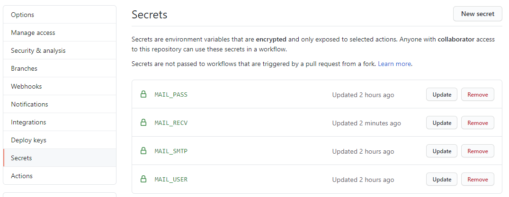

# Threat-Broadcast
威胁情报播报

------

## 运行环境

  


## 项目介绍

从以下公开的威胁情报来源爬取并整合最新信息：

- 360：https://cert.360.cn/warning
- 奇安信：https://ti.qianxin.com/advisory/
- 红后：https://redqueen.tj-un.com/IntelHome.html
- 绿盟：http://www.nsfocus.net/index.php
- 安全客：https://www.anquanke.com/vul
- 斗象：https://vas.riskivy.com/vuln

爬取到的 CVE 情报会作如下处理：

- 【实时播报】 接收播报信息的 QQ 群： `283212984`
- 【实时播报】 接收播报信息的 WeChat 公众号： [\[名称\]`EXP技术` \[微信号\]`exp-blog`](imgs/wechat.png)
- 【邮件播报】 接受播报信息的邮箱配置： [recv/mail_*.dat](recv/mail.dat)
- 【页面播报】 最新的 TOP10 威胁情报会更新到 [Github Page](https://lyy289065406.github.io/threat-broadcast/)
- 【情报归档】 所有威胁情报会归档到 [sqlite](data/cves.db)


> 目前最有效的推送方式是邮件推送（建议使用手机邮箱，如 [139](https://appmail.mail.10086.cn) 可触发短信通知）
<br/> 因 Smart QQ 已停止服务，暂无法实现 QQ 群自动推送（*TODO： [QQ 群 API](https://qun.qq.com/doc.html)*）
<br/> 因 WeChat 公众号停止个人号群发服务，现只能用户自己手动获取推送

<details>
<summary>播报效果</summary>
<br/>


</details>


## 订阅方式

- 【开发者订阅】 可自行 Fork 项目，通过配置定时任务向自己的邮箱推送即可
- 【个人订阅】 在 [Issues](https://github.com/lyy289065406/threat-broadcast/issues) 留下你接收情报用的邮箱，我会不定时处理
- 【个人订阅】 加入 QQ 群： 283212984
- 【个人订阅】 关注 WeChat 公众号：
<br/>　　**名称**： EXP技术
<br/>　　**微信号**： exp-blog
<br/>


## 威胁情报推送源

- QQ 群： 283212984
- WeChat 公众号： [\[名称\]`EXP技术` \[微信号\]`exp-blog`](imgs/wechat.png)
- 邮箱： 
<br/>　　ThreatBroadcast@126.com
<br/>　　threatbroadcast@qq.com
<br/>　　threatbroadcast@foxmail.com


> 认准我的推送源，勿点击来历不明链接，慎防钓鱼


## 开发者部署

<details>
<summary><b>无服务器方式（推荐）</b></summary>
<br/>

本项目已配置 [Github workflow](https://docs.github.com/cn/actions/configuring-and-managing-workflows/configuring-a-workflow)，因此你只需轻松两步即可实现部署：

- [Fork](https://github.com/lyy289065406/threat-broadcast) 本项目到你的代码仓库
- 通过 Settings --> Secrets 配置用于 **发送** 威胁情报邮件 3 个环境变量：
<br/>　　`MAIL_SMTP`： SMTP 服务器（国内推荐 QQ），如 `smtp.qq.com`
<br/>　　`MAIL_USER`： 邮箱账号，如 `threatbroadcast@qq.com`
<br/>　　`MAIL_PASS`： 邮箱密码
- 编辑 [`recv/mail_*.dat`](recv/mail.dat) 文件即可，按需增删改用于 **接收** 威胁情报邮件的邮箱



此后程序便会在每小时的 15 分执行一次（若要调整执行频率，可修改 [`.github/workflow/autorun.yml`](.github/workflow/autorun.yml) 的 `schedule` 触发时点），同时自动生成 [Github Page](https://lyy289065406.github.io/threat-broadcast/) 播报页面。


</details>


<details>
<summary><b>有服务器方式</b></summary>
<br/>

### 安装

- 任意找一台 Linux 服务器（阿里云、腾讯云等）
- 安装 python 2.7
- 把仓库 checkout 到服务器本地： `git clone https://github.com/lyy289065406/threat-broadcast`

> 国内的云主机（阿里云/腾讯云等）为了避免滥发邮件默认关闭了对 SMTP 25 端口的出口流量，直接导致邮件无法发送。 解封需要到控制台申请，例如 《[阿里云 25 端口解封](https://help.aliyun.com/knowledge_detail/56130.html?spm=a2c4e.11153940.0.0.50664791wrBD3D&source=5176.11533457&userCode=r3yteowb&type=copy)》、 《[腾讯云 25 端口解封](https://cloud.tencent.com/document/product/213/40436)》


### 配置定时任务

- 修改 crontab 配置文件，设置定时任务： `vim /etc/crontab`
- 设置定时任务命令（每小时）： `0 * * * * root python ${workspace}/threat-broadcast/main.py [-any_args]`
- 注意脚本位置需使用绝对路径，根据实际 checkout 的位置修改即可
- 保存 crontab 配置文件后会自动生效，查看日志： `tail -10f /var/log/cron`

> 程序运行参数可通过 [`main.py -h`](main.py) 查看帮助文档


### 自动生成 Github Page 播报页面

- 安装 git 命令行客户端
- 安装 GitPython 模块： `pip install GitPython`
- 打开项目目录： `cd ${workspace}/threat-broadcast`
- 设置使用 SSH 与 Github 连接（避免提交内容时要输入账密），详见 [这里](https://help.github.com/en/articles/connecting-to-github-with-ssh)
- 若设置 SSH 后还要输入密码才能提交，则还需要把仓库的 https 协议改成 ssh，详见 [这里](https://help.github.com/en/articles/changing-a-remotes-url#switching-remote-urls-from-https-to-ssh)
- [`main.py`](main.py) 添加运行参数 `-ac` 可自动提交变更到仓库


> 只要爬取到新的威胁情报则会刷新 [`docs/index.html`](docs/index.html)，将其提交到仓库会自动更新 [Github Page](https://lyy289065406.github.io/threat-broadcast/)

</details>

## 目录说明

```
threat-broadcast
├── README.md ............................... [项目说明]
├── main.py ................................. [程序运行入口]
├── cache ................................... [威胁情报缓存]
├── data
│   └── cves.db ............................. [sqlite: 威胁情报归档]
├── docs .................................... [Github Page 威胁情报总览]
├── recv
│   ├── mail.dat ............................ [接收威胁情报的邮箱]
│   └── qq_group.dat ........................ [接收威胁情报的 QQ 群]
├── src ..................................... [项目源码]
├── script .................................. [数据库脚本]
├── tpl ..................................... [模板文件]
├── imgs .................................... [项目图片]
└── log ..................................... [项目日志]
```


## 版权声明

　[-EXP%202016-blue.svg)](http://exp-blog.com)　[](https://www.gnu.org/licenses/gpl-3.0)

- Site: [http://exp-blog.com](http://exp-blog.com) 
- Mail: <a href="mailto:289065406@qq.com?subject=[EXP's Github]%20Your%20Question%20（请写下您的疑问）&amp;body=What%20can%20I%20help%20you?%20（需要我提供什么帮助吗？）">289065406@qq.com</a>


------
